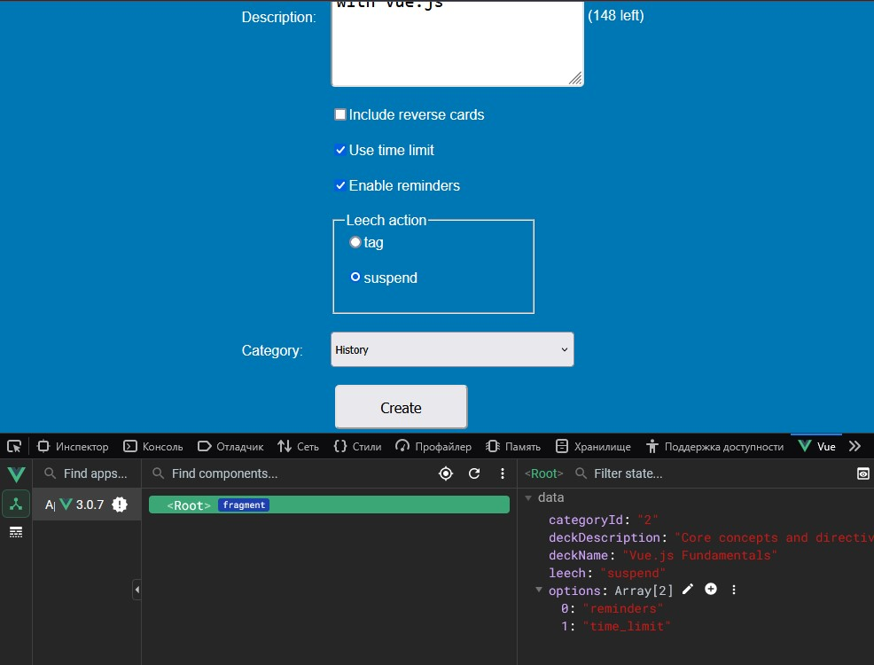

Learning Vue.js 2021

Final Branches:

1. Managing Dynamic Content and Behavior
2. Form Control Bindings
3. Rendering and Styling Logic
4. Using Vue Components

## 011-Configuring radio buttons and select elements

> Расширение Vue dev tools в Mozilla

https://addons.mozilla.org/en-US/firefox/addon/vue-js-devtools/

https://github.com/vuejs/devtools-v6/releases/tag/v6.6.3

Привязки v-model на странице и включение этого расширения дают понимание о возможности влияния из логики Vue на динамически изменяемые данные на странице.

## 012-Adding modifiers

Ещё модификаторы:

.stop  
.self  
.once  

## 

