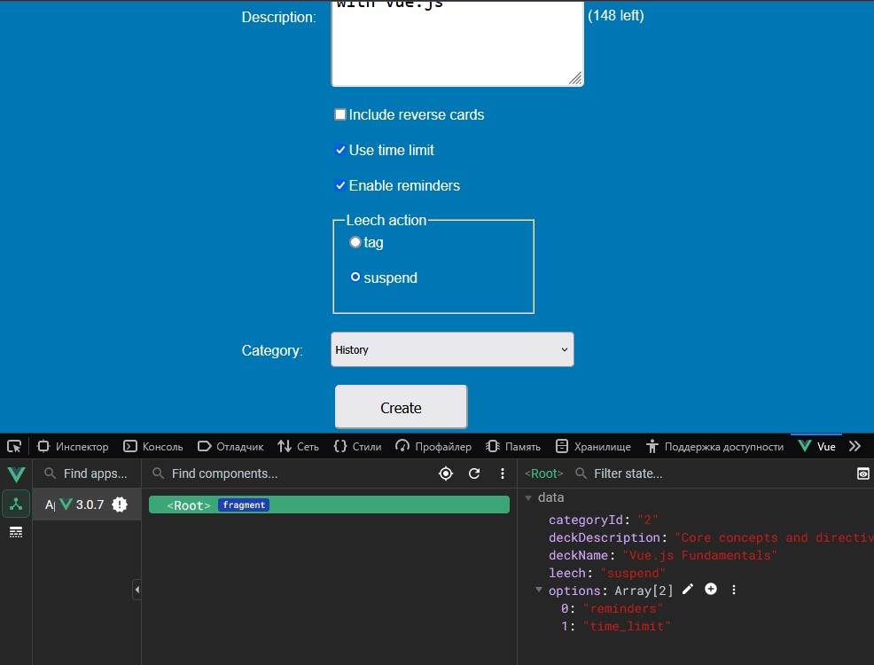

Learning Vue.js 2021

Final Branches:

1. Managing Dynamic Content and Behavior
2. Form Control Bindings
3. Rendering and Styling Logic
4. Using Vue Components

## 011-Configuring radio buttons and select elements

> Расширение Vue dev tools в Mozilla

https://addons.mozilla.org/en-US/firefox/addon/vue-js-devtools/

https://github.com/vuejs/devtools-v6/releases/tag/v6.6.3

Привязки v-model на странице и включение этого расширения дают понимание о возможности влияния из логики Vue на динамически изменяемые данные на странице.

## 012-Adding modifiers

Ещё модификаторы:

.stop  
.self  
.once  

## 020-Using component props

Если компонент не отображается в панели отладки в инструменте Vue в Firefox, то нужно перезагрузить панель отладки F12.

## 023-Installing Vue CLI

Single-File Components

https://vuejs.org/guide/scaling-up/sfc.html

https://cli.vuejs.org/

> Но сейчас используют create-vue   

https://github.com/vuejs/create-vue  

https://cli.vuejs.org/guide/  
https://cli.vuejs.org/guide/installation.html  

После установки Node:

    npm install -g @vue/cli
    vue --version

https://github.com/vuejs/vue-cli

Создание проекта:

    vue create flashcard-app

Запуск сервера

    cd .\flashcard-app\
    npm run serve

Запуск в браузере    

http://localhost:8080/

##

